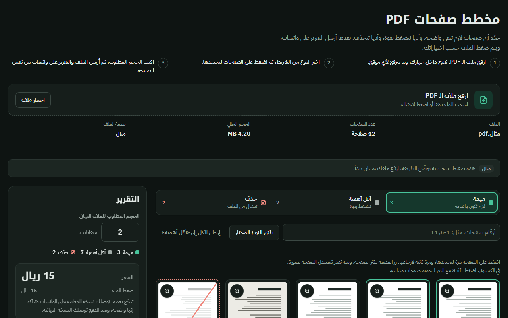

# PDF Page Planner
**A client-side tool for marking PDF pages by compression priority and generating structured preparation reports.**

**[Live Demo](https://shalabycode.dev/pdf-page-planner/)** · **[Source](https://github.com/Shalabyelectronics/pdf-page-planner)**



## About
PDF Page Planner (مخطط صفحات PDF) is an in-browser utility built to streamline document preparation for custom PDF compression and optimization services. Users can inspect pages, classify them by visual priority (important, less important, or marked for deletion), replace specific pages with images, and specify a target file size. The application processes files locally in the browser to maintain document privacy before generating a detailed order slip and dispatching it to WhatsApp.

## Features
- **RTL Arabic UI:** Native right-to-left user interface featuring custom typography, responsive layouts, and light/dark color scheme support.
- **Client-Side Document Inspection:** Loads and inspects PDF documents entirely in the browser using PDF.js without uploading files to a server.
- **Interactive Page Grid:** Visual card grid with lazy-loaded page thumbnails powered by the `IntersectionObserver` API.
- **Page Classification:** Categorize pages as "Important", "Less Important", or "Delete" with single clicks, range inputs (e.g., `1-5, 14`), or Shift-click selections.
- **Full-Screen Page Viewer:** Modal preview built with native `<dialog>` to inspect individual pages at high resolution, toggle marks, and navigate with keyboard arrow keys.
- **Page Replacement with Custom PDF Generation:** Replace any page with an uploaded image; the tool converts the image into a valid one-page PDF wrapper with custom metadata in JavaScript.
- **Cryptographic Hashing:** Computes SHA-256 file hashes client-side via the Web Crypto API to reference the exact document version.
- **WhatsApp & Web Share Dispatch:** Generates a formatted text summary with dynamic price calculation (SAR) and terms acceptance, sharing files via the Web Share API or linking directly to WhatsApp.

## Built With
- HTML5 (Semantic structure, native `<dialog>`)
- CSS3 (CSS Grid, Flexbox, CSS Custom Properties, `prefers-color-scheme`)
- Vanilla JavaScript (ES6+)
- [PDF.js](https://mozilla.github.io/pdf.js/) (v3.11.174 via CDN)
- Browser APIs: Web Crypto API (`SubtleCrypto`), HTML5 Canvas, Intersection Observer, Web Share API

## What I Learned
- Rendering PDF page viewports to HTML5 canvas elements and generating asynchronous thumbnail queues using PDF.js.
- Optimizing grid rendering performance for large documents using `IntersectionObserver` for lazy loading.
- Assembling raw PDF file structures in binary form (`Uint8Array`, cross-reference tables, dictionary objects) to wrap JPEG images inside valid PDF documents.
- Parsing and normalizing localized Arabic and Eastern Arabic numerical ranges into numeric page sets.
- Implementing accessible modal dialogs and responsive RTL interface controls without external UI libraries.

## Getting Started
To run the project locally, clone the repository and open `index.html` in any modern web browser or serve it via a local development server.

```bash
git clone https://github.com/Shalabyelectronics/pdf-page-planner.git
cd pdf-page-planner
```

Open `index.html` in your browser, or start a static server (such as the VS Code Live Server extension).

## Project Structure
```text
pdf-page-planner/
├── docs/
│   └── screenshot.png
├── index.html
└── README.md
```

## Roadmap
- [ ] English UI localization toggle.
- [ ] In-browser page rotation before exporting the planner report.
- [ ] Drag-and-drop page reordering within the grid.
- [ ] Offline caching support using a Service Worker.

## Author
Mohamed Shalaby
- Website: https://shalabycode.dev
- GitHub: https://github.com/Shalabyelectronics
- LinkedIn: https://www.linkedin.com/in/mhdshalaby/
